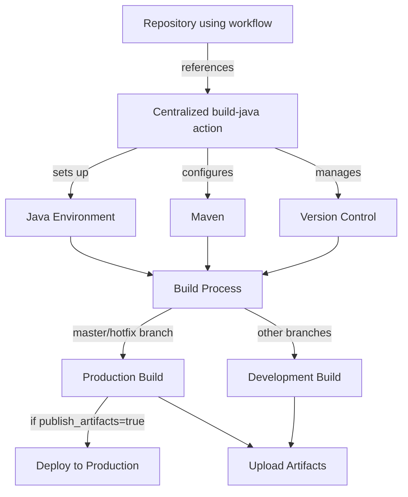

# Centralized Java Build Workflow Documentation

## 1. Introduction

This document provides comprehensive documentation for the centralized Java build workflow implemented as a reusable GitHub Action. This workflow standardizes the build process for Java/Maven projects across the organization, ensuring consistency, reliability, and maintainability.

The centralized workflow handles Java environment setup, Maven configuration, version management, and artifact deployment, adapting its behavior based on the branch being built (master, hotfix, or development branches).

**Target Audience:**
- Java developers working on Maven-based projects
- DevOps engineers maintaining CI/CD pipelines
- Technical leads overseeing multiple Java repositories

## 2. Workflow Architecture



The workflow follows a branch-based strategy:
- **Master/Main Branch**: Treated as production releases with proper versioning
- **Hotfix Branches**: Special handling for urgent fixes with version increments
- **Other Branches**: Treated as development builds with commit-based versioning

## 3. Technical Details

### Environment Setup
The workflow sets up the Java development environment with configurable Java version and distribution. It uses the official `actions/setup-java` action to ensure consistent Java installations across all builds.

### Maven Configuration
Maven is configured with a specific version and caching is implemented to speed up builds. The workflow uses the `stCarolas/setup-maven` action and configures the Maven cache using `actions/cache`.

### Git Configuration
The workflow configures Git with a specific user identity (`clearci`) to ensure consistent commit authoring and proper access to repositories.

### Version Management
Version management is a key feature of this workflow:

- **Master/Main Branch**: Increments the minor version and sets patch to 0 (e.g., 1.2.0 → 1.3.0)
- **Hotfix Branch**: Increments the patch version if needed (e.g., 1.2.0 → 1.2.1)
- **Other Branches**: Uses a development version based on the commit SHA (e.g., dev-a1b2c3d4)

### Build Process
The build process varies based on the branch:

- **Master/Hotfix**: Performs a full Maven release process with proper tagging
- **Other Branches**: Performs a standard Maven package operation

### Artifact Handling
All builds upload artifacts to GitHub Actions, making them available for download. For production builds (master/hotfix), artifacts can optionally be deployed to a Maven repository.

## 4. Implementation Guide

### Referencing the Workflow

To use this centralized workflow in your repository, add a GitHub Actions workflow file (e.g., `.github/workflows/build.yml`) with the following content:

```yaml
name: Build

on:
  push:
    branches: [ main, master, 'hotfix/**' ]
  pull_request:
    branches: [ main, master ]

jobs:
  build:
    runs-on: ubuntu-latest
    steps:
      - uses: actions/checkout@v4
        with:
          fetch-depth: 0
      
      - name: Build Java Project
        uses: organization/build-java@main
        with:
          token: ${{ secrets.GITHUB_TOKEN }}
          # Optional overrides
          # java_version: '11'
          # maven_version: '3.8.6'
          # publish_artifacts: 'true'
```

### Required Configuration

The only required configuration is the GitHub token, which is used for authentication with GitHub APIs and repositories.

## 5. Customization Options

The workflow provides several customization options through input parameters:

| Parameter | Description | Default | When to Override |
|-----------|-------------|---------|------------------|
| `java_version` | The Java version to use | `17` | When your project requires a specific Java version |
| `java_distribution` | The Java distribution to use | `zulu` | When you need a specific distribution (e.g., `adopt`, `temurin`) |
| `maven_version` | The Maven version to use | `3.8.3` | When your project requires a specific Maven version |
| `maven_flag` | Maven command-line flags | `-T 4C -B --no-transfer-progress` | When you need to adjust Maven behavior |
| `token` | The GitHub token | *Required* | N/A - Always required |
| `publish_artifacts` | Whether to publish artifacts | `false` | Set to `true` when you want to deploy artifacts to a Maven repository |
| `ref` | The ref to build | `${{ github.ref }}` | When you need to build a specific ref other than the current one |

### Output Values

The workflow provides the following outputs:

| Output | Description | Usage |
|--------|-------------|-------|
| `version` | The version of the built artifact | Access with `${{ steps.build.outputs.version }}` |

## 6. Advantages of Centralization

### Improved Build Reliability
By centralizing the build workflow, we ensure that all repositories use the same tested and validated build process, reducing the likelihood of build failures due to misconfiguration.

### Simplified Troubleshooting
When issues occur, they can be diagnosed and fixed in one place, with the fix immediately applying to all repositories using the workflow.

### Faster Feature Rollouts
New features or improvements to the build process can be implemented once and immediately benefit all repositories.

### Standardization Across Repositories
All Java projects in the organization follow the same build patterns, making it easier for developers to work across multiple projects.

### Easier Implementation of Best Practices
Build best practices can be implemented in the centralized workflow and automatically applied to all repositories.

### Reduced Maintenance Overhead
Instead of updating dozens or hundreds of workflow files across repositories, changes only need to be made in one place.

## 7. Migration Guide

### Steps to Migrate from Repository-Specific Workflows

1. **Audit Existing Workflows**: Review your current repository-specific workflow to identify any custom steps or configurations
2. **Identify Required Customizations**: Determine which aspects need to be preserved as custom configurations
3. **Create New Workflow File**: Create a new GitHub Actions workflow file that references the centralized action
4. **Configure Parameters**: Set the appropriate input parameters to match your project's requirements
5. **Test the Workflow**: Run the workflow on a branch to ensure it works as expected
6. **Update Documentation**: Update your repository's documentation to reflect the new build process
7. **Remove Old Workflow Files**: Once the new workflow is working correctly, remove the old workflow files

### Common Migration Issues

- **Custom Build Steps**: If your repository has custom build steps, consider whether they can be incorporated into the centralized workflow or need to remain repository-specific
- **Version Compatibility**: Ensure the Java and Maven versions specified in the centralized workflow are compatible with your project
- **Dependencies**: Verify that all required dependencies are properly resolved with the centralized workflow

## 8. Troubleshooting

### Common Issues and Solutions

| Issue | Possible Cause | Solution |
|-------|---------------|----------|
| Build fails with Java version error | Project requires a different Java version | Override the `java_version` parameter |
| Maven dependency resolution fails | Network issues or repository configuration | Check Maven settings and network connectivity |
| Version conflicts | Multiple version definitions | Ensure version is only defined in one place |
| Git authentication issues | Token permissions | Ensure the GitHub token has appropriate permissions |

### Debugging Build Failures

1. Check the GitHub Actions logs for specific error messages
2. Verify that all required secrets and variables are properly configured
3. Try running the build locally to see if the issue is environment-specific
4. Check if the issue is specific to your repository or affects multiple repositories

### Support Resources

- GitHub repository issues: Report issues with the centralized workflow
- Internal documentation: Additional organization-specific guidance
- DevOps team: Contact for assistance with complex build issues

## 9. Future Enhancements

### Planned Improvements

- Support for additional Java distributions
- Integration with code quality tools
- Enhanced test reporting
- Performance optimizations for large projects

### Requesting Features or Reporting Issues

To request new features or report issues with the centralized workflow, please open an issue in the `build-java` repository with a detailed description of your requirements or the problem you're experiencing.